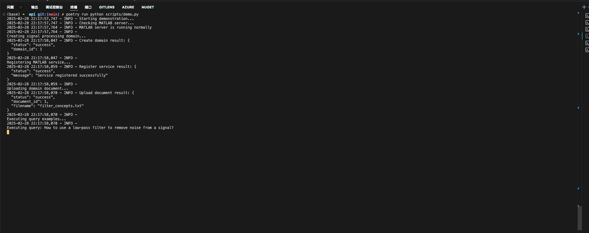

# Professional Domain LLM Framework

A professional domain-specific LLM framework that enables intelligent API execution planning and domain-specific knowledge integration. This framework bridges the gap between natural language understanding and professional software API execution.

## Demo



*Demo shows: Natural language query being transformed into API execution plan and subsequent execution with MATLAB mock server for signal processing tasks.*

## Core Concept

This framework serves as an intelligent agent that helps users interact with specialized scientific software APIs through natural language. The key workflow is:

1. **Configuration**: Users configure their specific scientific application APIs, upload relevant documentation and data
2. **Knowledge Integration**: The system processes and indexes the API specifications and domain documentation
3. **Natural Language Understanding**: Users describe their scientific computing needs in natural language
4. **Execution Planning**: LLM generates precise API execution plans based on retrieved context
5. **API Orchestration**: The system executes the planned API sequence and returns scientific computation results

The framework is particularly useful for:
- Scientific computing and analysis tasks
- Specialized domain software integration
- Complex multi-step API workflows
- Domain-specific knowledge application

## Current Features

### 1. API Execution Planning
- Automatic API execution plan generation from natural language input
- Multi-step operation sequence planning
- Parameter extraction and validation
- Context-aware execution strategy

### 2. RAG (Retrieval-Augmented Generation)
- Document and API specification ingestion
- FAISS-based vector retrieval system
- Context-enhanced response generation
- Support for multiple document formats (.txt, .md, .json)

### 3. Mock Professional Software Integration
- Mock MATLAB server implementation
  - Common filter API simulation
  - Signal processing function examples
  - Professional domain workflow demonstration
- Extensible mock server architecture

### 4. Core System Features
- Multi-LLM provider support (OpenAI, Ollama)
- Prompt engineering with template management
- Session-level context management
- Multi-domain intent analysis
- Extensible adapter system

## Current Challenges & Future Improvements

### 1. RAG Enhancement
- [ ] Implement and evaluate alternative retrieval algorithms
- [ ] Improve retrieval stability and accuracy
- [ ] Add support for hybrid retrieval strategies
- [ ] Enhance context relevance scoring

### 2. User Data Integration
- [ ] Add support for user-uploaded data processing
- [ ] Implement document preprocessing pipeline
- [ ] Enhance document vectorization strategies
- [ ] Add support for more document formats

### 3. API Execution Accuracy
- [ ] Improve parameter mapping accuracy
- [ ] Enhance error handling and recovery
- [ ] Add execution validation steps
- [ ] Implement execution simulation mode

### 4. Domain Adaptation
- [ ] Expand professional software support
- [ ] Improve domain-specific knowledge integration
- [ ] Add support for custom API configurations
- [ ] Enhance domain-specific error handling

## Project Structure

The project consists of two main components:

### API Framework (`/api`)
Core LLM framework implementation with RAG capabilities and API execution planning.
[See API README for details](api/README.md)

### Mock Servers (`/mock_servers`)
Professional software simulation for testing and demonstration.
- MATLAB mock server with filter API implementation
- Extensible server architecture for adding more professional software simulations

## Quick Start

1. Start the API service:
```bash
cd api
poetry install
poetry run python run.py
```

2. Start the mock MATLAB server:
```bash
cd mock_servers/matlab
python server.py
```

3. Configure your environment variables in `.env`

## Usage Examples

### 1. API Execution Planning
```bash
curl -X POST http://localhost:8000/api/v1/plan \
  -H "Content-Type: application/json" \
  -d '{
    "query": "Apply a low-pass filter to my signal data with cutoff frequency 1000Hz",
    "domain": "signal_processing"
  }'
```

### 2. Document Integration
```bash
curl -X POST http://localhost:8000/api/v1/documents/upload \
  -F "file=@my_document.pdf" \
  -F "domain=signal_processing"
```

## Contributing

We welcome contributions! Key areas where you can help:
1. Implementing new retrieval algorithms
2. Adding support for more professional software
3. Improving API execution accuracy
4. Enhancing domain-specific features

## License

MIT 